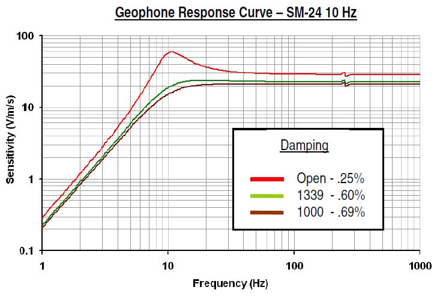
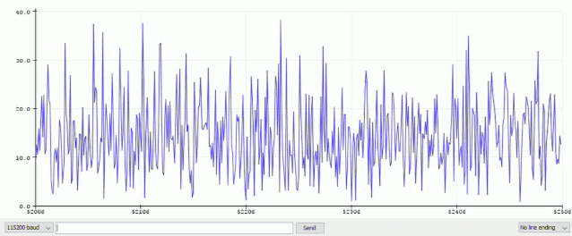

# OpenLog Artemis Geophone Logger: Hookup Guide

## Contents:
- [Background](#Background)
- [What do I need?](#What-do-I-need)
- [Prepare the geophone](#Prepare-the-geophone)
- [Connect the geophone to the Qwiic PT100](#Connect-the-geophone-to-the-Qwiic-PT100)
- [Connect the Qwiic PT100 to the OpenLog Artemis](#Connect-the-Qwiic-PT100-to-the-OpenLog-Artemis)
- [Add the microSD card](#Add-the-microSD-card)
- [Install the OLA geophone logger firmware](#Install-the-OLA-geophone-logger-firmware)
- [Start logging](#Start-logging)
- [What's under the hood?](#Whats-under-the-hood)

## Background

[Seismology](https://en.wikipedia.org/wiki/Seismology) is the study of earthquakes and other processes that relate to the propagation of elastic waves through the Earth.
If you have ever experienced an earthquake, you'll know exactly what we're talking about. But maybe you've been near a quarry or mine when they've been blasting; you will have experienced
seismic waves then too.

You can detect seismic waves with a [seismometer](https://en.wikipedia.org/wiki/Seismometer), which is an instrument that records the timing and characteristics of the motion of the ground.
If you have access to multiple seismometers, you can combine their data to calculate or triangulate the source of an earthquake.

A geophone is essentially a very sensitive, low frequency microphone used to detect the seismic waves. Traditional seismometers recorded the amplitude of the motion of the ground, but with modern electronic equipment it is also possible to study the frequency spectrum of the vibrations too.

We can create a fully digital seismometer by combining a geophone with an analog-to-digital converter (ADC) (which digitizes the signal from the geophone) and a microcontroller
(which can perform the frequency analysis and log the results to microSD card). This guide shows you how to create a sophisticated seismometer / geophone logger using the
SparkFun OpenLog Artemis.

## What do I need?

### Essentials:

- **[OpenLog Artemis - SPX-15846](https://www.sparkfun.com/products/15846)**
- **[Qwiic PT100 ADS122C04 - SPX-16770](https://www.sparkfun.com/products/16770)**
- **[SM-24 Geophone - SEN-11744](https://www.sparkfun.com/products/11744)**
- **1300Ω Resistor**
  - 1300Ω will give best performance but a [1000Ω (1KΩ) resistor](https://www.sparkfun.com/products/14492) will work too
  - You could connect a 1000Ω (1KΩ) and a 330Ω in series. You will find both in our [Resistor Kit](https://www.sparkfun.com/products/10969)
- **Stranded Hook-Up Wire**
  - The 22 AWG wire in our [Hook-Up Wire Assortment](https://www.sparkfun.com/products/11375) is a perfect choice
- **Qwiic Cable**
  - A [50mm Cable](https://www.sparkfun.com/products/14426) is all you need but our [Qwiic Cable Kit](https://www.sparkfun.com/products/15081) gives you all the options

### Extras:

- **[microSD Card](https://www.sparkfun.com/products/15107)**
- **[Lithium Ion Battery](https://www.sparkfun.com/products/13813)**
- **[USB-C Cable](https://www.sparkfun.com/products/15092)**

## Prepare the geophone

We need to do two things to get the geophone ready to use in our seismometer:
- Add a damping resistor
- Add some stranded hook-up wire

### Add a damping resistor

The SM-24 geophone has a very strong open-loop response at 10Hz (the red line in the plot below). We need to compensate for this by adding a damping resistor

A 1300Ω resistor gives best performance (the green line), but a 1000Ω resistor works well too and only attenuates the signal slightly (the brown line).

Solder the resistor across (in parallel with) the geophone pins. Please follow our [How to Solder](https://learn.sparkfun.com/tutorials/how-to-solder-through-hole-soldering) guide
if you are doing this for the first time.

### Add some stranded hook-up wire

We need to solder two lengths of stranded hook-up wire to the geophone pins. This is best done at the same time as when you solder on the damping resistor.

Keep the wires short. 150mm / 6" should be more than enough. After soldering the wires to the geophone pins, twist the wires together (to help minimise noise)
and then strip the ends so they can be inserted into the latch terminals on the Qwiic PT100.

## Connect the geophone to the Qwiic PT100

The Qwiic PT100 is designed to measure temperature very accurately using a 100Ω Platinum Resistance Thermometer. However, the heart of the Qwiic PT100 is the ADS122C04
24-bit analog-to-digital converter (ADC) which is perfect for digitizing the signal from the geophone. It has a differential input as well as adjustable gain (x1 to x128), which we can use to
amplify the small signals from the geophone.

Please check that the A/B/C jumpers on the back of the Qwiic PT100 are open. (They are open by default. Please clear them if you have been using the PT100 for 3-wire or 2-wire sensing.)

Connect the two wires from the geophone to terminals 2 and 3 on the Qwiic PT100. (The polarity does not matter, connect either wire to either terminal.)

## Connect the Qwiic PT100 to the OpenLog Artemis

Connect the Qwiic PT100 to the OLA using a Qwiic cable.

## Add the microSD card

Your microSD card needs to be formatted as FAT32, which limits its size to 32GB. That's still a lot of data (around 5 months of continuous logging)!
You can use a card larger than 32GB but formatting it as FAT32 will limit its effective size to 32GB. We hope to be able to support larger exFAT cards in the future.

Now insert your microSD card into the socket on the back of the OLA. The card clicks into place.

## Install the OLA geophone logger firmware

Connect the OLA to your computer using a USB-C cable and follow our [upgrade instructions](./UPGRADE.md) to install the latest geophone logger firmware binary on the OLA.

## Start logging

You are now ready to start logging data. If you are familiar with the Arduino IDE, you can open the Serial Monitor to see the menus and data from the OLA.

Alternatively, you can use a terminal emulator like Tera Term to see the data. Just make sure it is set to 115,200 Baud.

If you hit any key (send any character) the main menu will open allowing you to change the OLA's settings.

## What's under the hood?

The Artemis is doing all of the hard work for you: sampling the geophone signal, converting the samples to frequency data using a Fast Fourier Transform, and logging each reading
to microSD card.

You can adjust the gain of the ADS122C04 ADC using menu option 4. The gain can be set from x1 to x128. You can also set the amplitude threshold that the peak signal needs to exceed before it
is logged to SD card. This allows you to avoid logging all of the background noise between seismic waves.

The SM-24 geophone has a useful frequency range of 240Hz, so we need to be logging at 480Hz or more to be able to capture data across the full frequency range.
Have a look at [Nyquist-Shannon sampling](https://en.wikipedia.org/wiki/Nyquist%E2%80%93Shannon_sampling_theorem) to find out why. We round the 480Hz up to 500Hz to make life easier for ourselves.
We actually set the ADS122C04 sample rate to 600Hz to make sure we have a new conversion ready every 2 milliseconds.

The [Fast Fourier Transform](https://en.wikipedia.org/wiki/Fast_Fourier_transform) functions we use to convert the ADC samples into a frequency spectrum like to use data sizes that are powers of two.
We actually take 1024 samples at 500Hz before we start the FFT conversion and so we get new frequency data every two seconds. The OLA logs "frequency bins" 1 to 501 which corresponds to
0.5Hz to 250.5Hz in 0.5Hz increments.

If you enable Serial Plotter mode using menu option 1 followed by menu option 3, you can use the Arduino IDE Serial Plotter tool to plot the data for you. The left of the window is 0.5Hz,
the right is 250.5Hz. The vertical bars correspond to intervals of 50Hz. (We're fortunate that the Serial Plotter can plot 500 values at a time!) You will see fresh data scroll in every two
seconds; the scrolling speed is baud rate dependent (it takes approximately half a second for the fresh data to scroll across at 115200 baud). The Y-axis scales automatically depending on the peak amplitude.
It is normal to see low amplitude 'noise' displayed when there is no seismic activity.

If you look at the data in the files created on the microSD card, you'll see that there are 501 columns of data after the date and time. The 501st column contains the peak frequency signal in Hz.

The OLA geophone logger firmware uses two sample buffers so we can sample continuously. Fresh samples are recorded into one buffer while the other buffer is being analyzed using the FFT.

With no seismic activity, you will see a noisy low level signal. Tap your workbench and you'll see a large response. You can set the amplitude threshold to avoid logging all of that noise.

You can choose to log the date and time from the Artemis' Real Time Clock (RTC). (Why wouldn't you!?). You can also log a count which increments with each sample.

Please let us know what you've been up to and if you have enjoyed this project. You can contact us via the [SparkFun Artemis Feedback Forum](https://forum.sparkfun.com/viewforum.php?f=171&sid=40b4120c612da34b56c3892e7ac23c67).

Enjoy!

_**Your friends at SparkFun**_
